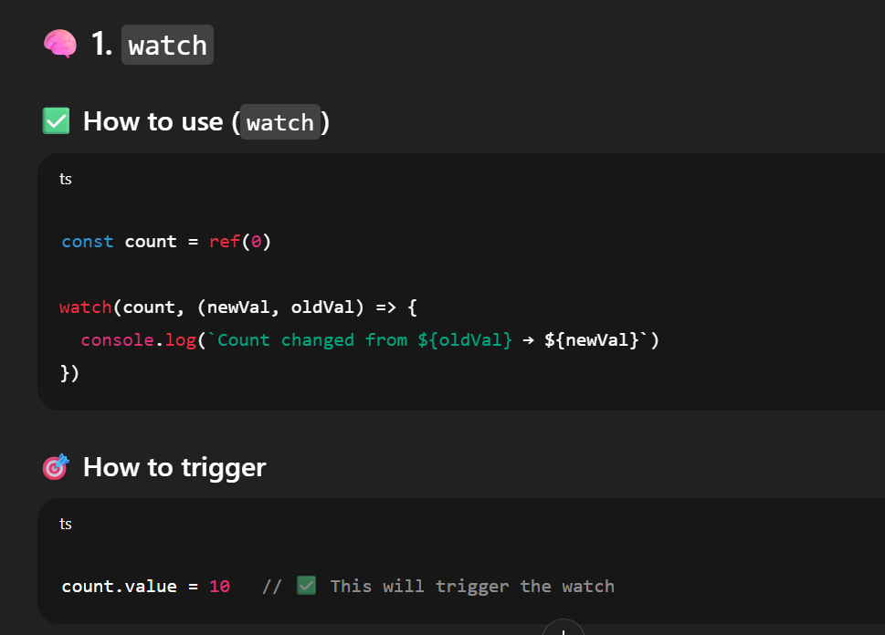

# ----------- Vue ( PWA ) --------------

## 📌 watch — (Like React’s useEffect with dependency array)
### It watches a variable or a function, and whenever that thing changes, it runs some code.

```ts
watch(source, callback, options?)

const age = ref(30)
const city = ref('Delhi')

watch([age, city], ([newAge, newCity], [oldAge, oldCity]) => {
  console.log(`Age: ${oldAge} → ${newAge}, City: ${oldCity} → ${newCity}`)
})
```



---

## 🧩 onMounted — (Like useEffect with [] in React)

Runs code only once, when the component is shown on the screen.

```ts
onMounted(async () => {
  const data = await fetchData()
  console.log('Data fetched:', data)
})

const inputRef = ref(null)

onMounted(() => {
  inputRef.value.focus()
})
```

---

## 🔌 inject + provide — (Like React Context)

Used to share data across components.

### In Parent.vue
```ts
import { provide, ref } from 'vue'
const message = ref('Hello from parent!')
provide('myMessage', message)
```

### In Child.vue
```ts
const message = inject('myMessage')
console.log(message.value) // → Hello from parent!
```

---

## 🧭 useRoute — (Get info about current page)

```ts
const route = useRoute()
console.log(route.params.id)
```

## 🚦 useRouter — (Go to another page programmatically)

```ts
const router = useRouter()
router.push({ name: 'home' })
```

### Conditional Redirect
```ts
if (!isLoggedIn.value) {
  router.replace({ name: 'login' })
}
```

---

## 🎁 defineProps — (Like React props)

### Parent.vue
```vue
<MyCard title="Welcome to Wortal" />
```

### Child.vue
```ts
const props = defineProps(['title'])
console.log(props.title)
```

---

## 📣 emitter.on('event') + emitter.emit('event') — Global Event Bus

### In main.ts (Global Setup)
```ts
import mitt from 'mitt'
const emitter = mitt()
app.provide('emitter', emitter)
```

### In Sidebar.vue
```ts
const emitter = inject('emitter')
emitter.on('refresh-data', () => {
  console.log('Refreshing menu data!')
})
```

### In Header.vue
```ts
const emitter = inject('emitter')
emitter.emit('refresh-data')
```

This will notify everyone listening to `'refresh-data'`.

---

## 🧠 deep: true ka matlab kya hota hai?

When you're watching an object/array/nested property, Vue by default doesn’t go deep.

```ts
const person = ref({ name: 'Amar', age: 25 })
watch(person, (newVal, oldVal) => {
  console.log('Changed!')
}, { deep: true })
```

✅ `deep: true` ensures that even if a nested field like `person.value.age` changes, the watcher will trigger.

